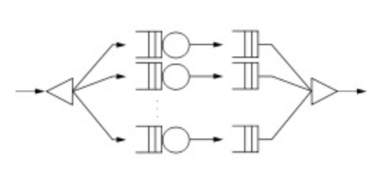

<!-- page_number: true -->
<!-- $theme: default -->
<!-- $size: 16:9 -->
<!-- footer: Concurrency API - ForkJoinFramework in Java7 -->

# Concurrency API in Java 7

With Java 7 the ForkJoin-Framework was shipped for handling parallel threads in Java.

ForkJoin is not intented to replace or compete with existing concurrency utility classes.

It updates and completes them!

---
# ForkJoin's Logic

Fork/Join addresses the need for __divide-and-conquer__, or __recursive task-processing__ in Java programs!

## Very simple logic:
1. separate (__fork__) each large task into smaller tasks
1. __process__ each task in a separate thread (separating those into even smaller tasks if necessary)
1. __join__ the results.

---
# What is Fork-Join?

Think of a fork in the road where each path eventually comes back together — joins.

Fork-Join breaks an application into several parts for parallel processing and joins the results at the end.



---
# Example Array Processing
```
for (int i = 0; i < 1000; i++) {
      total += doProcedure(array[i]);
  }
```
_If the procedure takes one second (wall-clock time) to complete, then it is going to take one thousand seconds (over 16½ minutes) to complete this task._

---
# Fork-Join could
- separate (fork) the large array into ten arrays of one hundred elements each,
- processes each array on a separate CPU, and
- join the results when finished.

_That would take one hundred seconds (just over 1½ minutes), one tenth of the original time. The more CPU's available, the faster the result._


---
# Divide and Conquer
... is a natural paradigm for parallel algorithms. 

- After dividing a problem into two or more sub-problems,
- the method solves the sub-problems in parallel. 
- Typically, the sub-problems are solved recursively and thus the next divide step yields even more sub-problems for solving in parallel.


_Hint: Beside parallel computing, using Dynamic Programming often helps to speed up the calculation of Divide and Conquer!_

---
# ForkJoin's tasks
more lightweighted than threads --> When creating a ForkJoinPool we can _back_ it up with a fixed number of threads while handling even more tasks!
```new ForkJoinPool(maxThreads);```

On this pool we can ```invoke```objects of type ```RecursiveAction```:
```pool.invoke(new MyRecursiveAction(...)```

---
# MyRecursiveAction Class

```
public class MyRecursivceAction extends RecursiveAction {   

    @Override
    public void compute() {
    	// This is the workhorse method!!
        // Within this method we can fork / join new tasks
        // following the "devide and conquere" logic!  
        if (condition) {


    }
}

```
See Javadocs: https://docs.oracle.com/javase/7/docs/api/java/util/concurrent/RecursiveAction.html

---
