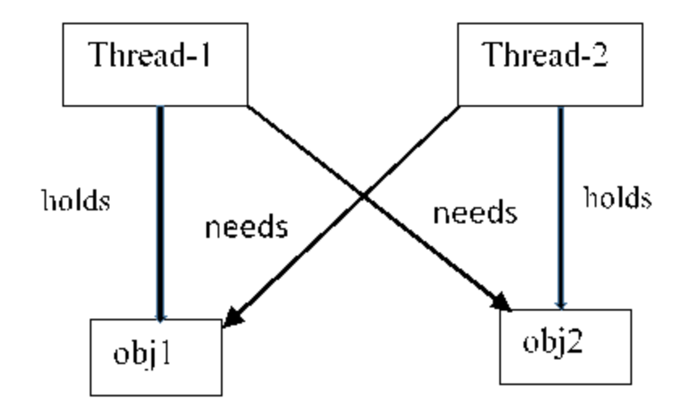

<!-- page_number: true -->
<!-- $theme: default -->
<!-- $size: 16:9 -->
<!-- footer: Concurrency API - Deadlocks in Java7 -->

# Java Threading
## - Deadlocks
## - Java Synchronization
## - ReentrantLock in Java Concurrency

---
Deadlock in multi-threading describes __a situation where two or more threads are blocked forever, waiting for each other__.




Deadlock in Java multi-threading environment may happen in case where:
- One synchronized method is called from another synchronized method.
- There are nested synchronized blocks.

---

# Avoid Deadlocks
 - carefully think when acquiring a lock on a shared ressource
 - think of the order in which locks are acquired
 - try to use synchronized blocks instead of sychronized methods. These hold the lock for less time.


---
# The ```synchronized``` keyword in Java

When more than one threads are trying to access a shared resource we need to have some mechanism to ensure that the resource will be used only by one thread at a time. 

The process by which it is ensured is called __synchronization__ in multi-threading.

---
# Synchronization in Java
Java uses _concept of monitor_ for synchronization

Every object created in Java has one associated monitor (_mutually exclusive lock_). At any given time only one thread can own the monitor.

Two basic synchronization idioms:
- synchronized methods
- synchronized statements (also known as synchronized blocks).

_Before any thread executes the code which is with in a synchronized method (or synchronized block) compiler provides instructions to acquire the lock on the specified object._

---
When __any thread acquires a lock__ it is said to have __entered the monitor__. All __other threads__ which need to execute the same shared piece of code (locked monitor) will be __suspended__ until the thread which initially acquired the __lock releases__ it.  
  
_Where can we use synchronized keyword in Java?_
- instance method
- An enclosed code block with in an instance method (Synchronized block).
- static method
- An enclosed code block with in a static method.

---
# Synchronized Instance Method 
```java
public synchronized void method_name(parameter_list){
}
```
## Example
We have a __class Message__ whose object will be shared among threads. In class Message there is a __method displayMsg__ and you want one thread to finish printing the message within the method then only another thread starts executing the method.

---
```java
// This class' shared object will be accessed by threads
class Message{
 public void displayMsg(String msg){
   System.out.println("Inside displayMsg method " + Thread.currentThread().getName());
   System.out.println("**" + msg); 
   try {
      Thread.sleep(10);
   } catch (InterruptedException e) {
      e.printStackTrace();
   }
   System.out.println("*");
 }
}
```
---
```java
class MyClass implements Runnable{
  Thread t;
  Message msg;
  String message;
  MyClass(Message msg, String str){ 
    this.msg = msg;
    this.message = str;
    // creating threads, 4 threads will be created 
    // all sharing the same object msg
    t = new Thread(this);
    t.start();
  }
  @Override
  public void run() {
     msg.displayMsg(message);
  }
}
````
---
```java
public class SynchronizedDemo {
  public static void main(String[] args) {
    Message msg = new Message();
    MyClass mc1 = new MyClass(msg, "I");
    MyClass mc2 = new MyClass(msg, "am");
    MyClass mc3 = new MyClass(msg, "not");
    MyClass mc4 = new MyClass(msg, "synchronized");
  }
}
```
```console
Inside displayMsg method Thread-0
Inside displayMsg method Thread-3
**synchronized
Inside displayMsg method Thread-1
**am
Inside displayMsg method Thread-2
**not
**I
*
*
*
*
```
---
The output is totally mixed up because all 4 threads share the same object and synchronized keyword is not used to ensure that only single thread has the lock on the object and only that thread can execute the method.

If we synchronize the method only a single thread will access the method at the given time. In that case the displayMsg() method will look like this:
```java
class Message{
    public synchronized void displayMsg(String msg){
        System.out.println("Inside displayMsg method " + Thread.currentThread().getName());
        System.out.print("**" + msg);        
        try {
            Thread.sleep(3);
        } catch (InterruptedException e) {
            e.printStackTrace();
        }
        System.out.println("*");
    }
}
```
---
Output:
```console
Inside displayMsg method Thread-0
**I*
Inside displayMsg method Thread-1
**am*
Inside displayMsg method Thread-2
**not*
Inside displayMsg method Thread-3
**synchronized*
````
- one thread finishes its execution then only another thread starts its execution of the method.
- _Though which thread is picked first is up to the scheduler that's why the message may not print correctly_

---
# Synchronized statement(block) in instance method:
- You don't need to synchronize the whole method
- synchronize those lines only that are contained in the critical section (shared ressource)
```java
Synchronized(object_reference){
// code block
}
```
--- 
```java
//This class' shared object will be accessed by threads
class Message{
    public void displayMsg(String msg){
        System.out.println("Inside displayMsg method " + Thread.currentThread().getName());
        synchronized(this){
            System.out.print("**" + msg);        
            try {
                Thread.sleep(3);
            } catch (InterruptedException e) {
                e.printStackTrace();
            }
            System.out.println("*");
        }
    }
}
```

---
Output:
```console
Inside displayMsg method Thread-0
Inside displayMsg method Thread-3
Inside displayMsg method Thread-2
Inside displayMsg method Thread-1
**I*
**am*
**not*
**synchronized*
```

- It can be seen from the output how the first print statement is executed by all the threads as that is not inside the synchronized block.
- After that only a single thread executes at a time and finishes its execution of the synchronized block only then another thread enters the synchronized block.

---
# Drawbacks of Synchronization
Can introduce __thread contention__:
  - occurs when two or more threads try to access the same resource simultaneously
  - cause the Java runtime to execute one or more threads more slowly
  - thread Starvation and livelock are forms of thread contention.

---
# ReentrantLock in Java Concurrency
..._one implementation of the lock interface_
 - every object created in Java has one mutually exclusive lock associated with it
 - when using synchronized we are using that lock implicitly
 - whereas when we are using any of the lock implementation (like ReentrantLock), we are using that lock explicitly
 - there are methods like ```lock()``` to acquire the lock and ```unlock()``` to release the lock

_Along with that ReentrantLock in Java provides many other features like fairness, ability to interrupt and a thread waiting for a lock only for a specified period._

---
# Why it is called ReentrantLock
It is called ReentrantLock 
- as there is an __acquisition count associated with the lock__ which means when you use ```lock()``` method to acquire a lock and you get it then the acquisition count is 1.
- will also allow the lock holder to enter another block of code with the same lock object as thread already owns it.
- if a thread that holds the lock acquires it again, the acquisition count is incremented and the lock then needs to be __released twice to truly release__ the lock.

---
# Example
Here two threads are created. 
In the run method of the thread class ```methodA()``` is called which uses the same lock object to control access.
- Whichever thread acquires the lock will also be able to access ```methodA()``` critical section as it already holds the lock. Acquisition count will become 2.
- Since in the ```methodA()```, ```unlock()``` method is not used to release the lock (_remember we need to release it twice as acquisition count is 2_). So another thread will never get a chance to acquire a lock.

---
```java
public class ReentrantDemo {
    public static void main(String[] args) {
        ReentrantLock rLock = new ReentrantLock();
        Thread t1 = new Thread(new Display("Thread-1", rLock));
        Thread t2 = new Thread(new Display("Thread-2", rLock));
        System.out.println("starting threads ");
        t1.start();
        t2.start();
    }
}

class Display implements Runnable {
    private String threadName;
    ReentrantLock lock;
    Display(String threadName, ReentrantLock lock){
        this.threadName = threadName;
        this.lock = lock;
    }
    @Override
    public void run() { ... }
    
    public void methodA(){ ... }    
}
```

---
```java
    public void run() {
        System.out.println("In Display run method, thread " + threadName + 
         " is waiting to get lock");
        //acquiring lock
        lock.lock();
        try {
            System.out.println("Thread " + threadName + "has got lock");
            methodA();
        } finally{ lock.unlock(); <}        
    }

    public void methodA(){
        System.out.println("In Display methodA, thread " + threadName + 
          " is waiting to get lock");
        //try {            
            lock.lock();            
            System.out.println("Thread " + threadName + "has got lock");
            System.out.println("Count of locks held by thread " + threadName + 
             " - " + lock.getHoldCount());
            // Not calling unlock
            /*} finally{
            lock.unlock();
        }*/
    }    
```

---
# Output
```console
starting threads 
In Display run method, thread Thread-1 is waiting to get lock
In Display run method, thread Thread-2 is waiting to get lock
Thread Thread-1has got lock
In Display methodA, thread Thread-1 is waiting to get lock
Thread Thread-1has got lock
Count of locks held by thread Thread-1 - 2
```

- both thread starts and Thread-1 acquires a lock
- Thread-1 will acquire the same lock again in ```methodA()``` but there it is not released
- method ```lock.getHoldCount()``` which gives the count of holds on this lock by the current thread.
- ```unlock()``` method is not called so lock is never released that is why Thread-2 never gets a chance to acquire a lock.

---
# Correct code and use ```unlock()```
```java
    public void methodA(){
        System.out.println("In Display methodA, thread " + threadName 
         + " is waiting to get lock");
        //acquiring lock
        lock.lock();
        try {
            System.out.println("Thread " + threadName + "has got lock");
            System.out.println("Count of locks held by thread " + threadName 
             + " - " + lock.getHoldCount());
        } finally{
            lock.unlock();
        }
    }  
```

---
# Output
```console
starting threads 
In Display run method, thread Thread-1 is waiting to get lock
In Display run method, thread Thread-2 is waiting to get lock
Thread Thread-1has got lock
In Display methodA, thread Thread-1 is waiting to get lock
Thread Thread-1has got lock
Count of locks held by thread Thread-1 - 2
Thread Thread-2has got lock
In Display methodA, thread Thread-2 is waiting to get lock
Thread Thread-2has got lock
Count of locks held by thread Thread-2 - 2
```
- Now both threads are able to run as the locks are properly release after acquiring.

---
# Convention while using ReentrantLock in Java
When you are using Reentrantlock in Java, it is a __recommended practice to always immediately follow a call to lock with a try block__.

If you will call ```lock()``` method with in the try block and some thing goes wrong while acquiring the lock finally block will still be called and there you will have ```lock.unlock()``` method.

So you will end up unlocking the lock which was never acquired and that will result in ```IllegalMonitorStateException```, that’s why it is recommended to call lock() method before try block.

At the same time you do want to unlock the acquired lock if something goes wrong after acquiring the lock, that is why immediately follow a call to lock with try block.

---
# Features of ReentrantLock in Java
- __Fairness__ - constructor takes boolean value as an argument. 
  - whether you want a fair or an unfair lock: A __fair lock__ is one where the threads acquire the lock in the same order they asked for it; whereas in case of an __unfair lock__ a thread can sometimes acquire a lock before another thread that asked for it first.
  - ```public ReentrantLock(boolean fair)```
- __Lock interruptibility__  - ReentrantLock provides a method ```lockInterruptibly```, where the thread acquires a lock if it is not interrupted.
- __Ability to check if the lock is being held__ - check if the lock is already being held using ```tryLock()``` method.
  - Acquires the lock only if it is not held by another thread at the time of invocation
  - ```tryLock(long timeout, TimeUnit unit)```- Acquires the lock if it is not held by another thread within the given waiting time and the current thread has not been interrupted. 

---
- Some of the other methods in ReentrantLock class:
  - ```getHoldCount()``` - Queries the number of holds on this lock by the current thread.
  - ```getWaitingThreads(Condition condition)``` - Returns a collection containing those threads that may be waiting on the given condition associated with this lock.
  - ```isHeldByCurrentThread()``` - Queries if this lock is held by the current thread.
  - ```isLocked()``` - Queries if this lock is held by any thread. 

---
# Drawbacks of ReentrantLock
- __Need to wrap lock acquisitions__ in a try/finally block and release the lock in finally block. Otherwise, if the critical section code threw an exception, the lock might never be released.
- Need to __call ```unlock()``` method__ explicitly. Forgetting to do that will result in lock never getting released which will create a lots of problem and make it very hard to detect performance problems. 
- With synchronization, the JVM ensures that locks are automatically released.

__Example Code__ using ReentrantLocks: https://gist.github.com/ulat/2ccc71f0fcf7854d59151225d42c83ad

---
# Difference Between ReentrantLock and Synchronized in Java
- When you use a __synchronized block or method__ you just need to __write synchronized__ keyword (and provide associated object) __acquiring lock and releasing it is done implicitly__. 
With __ReentrantLock__ acquiring and releasing lock is __done by user__ using ```lock()``` and ```unlock()``` methods.
- Prescribed way to use RentrantLock in Java is to use a try-finally block and release the lock in finally methods. That way lock will be released even if exception is thrown in critical section code.
- Synchronized forces all lock acquisition and release to occur in a block-structured way 
--> when multiple locks are acquired they must be released in the opposite order
--> all locks must be released in the same lexical scope in which they were acquired
---
- ReentrantLock provides __more flexibility__:
  - allows a lock to be acquired and released in different scopes
  - allowing multiple locks to be acquired and released in any order
- This code is __only valid with ReentrantLocks__:
```java
private ReentrantLock lock;
public void methodA() {
  ...
  lock.lock();
  ...
}

public void methodB() {
  ...
  lock.unlock();
  ...
}
````
---
- __ReentrantLock provides additional functionality__ over the use of synchronized methods and statements:
  - fairness, providing a non-blocking attempt to acquire a lock (```tryLock()```),
  - an attempt to acquire the lock that can be interrupted (```lockInterruptibly()```, and 
  - an attempt to acquire the lock that can timeout (```tryLock(long, TimeUnit)```).
- __Other features provided by ReentrantLock:__
  - ```getHoldCount()``` - Queries the number of holds on this lock by the current thread.
  - ```getWaitingThreads(Condition condition)``` - Returns a collection containing those threads that may be waiting on the given condition associated with this lock.
  - ```isHeldByCurrentThread()``` - Queries if this lock is held by the current thread.
  - ```isLocked()``` - Queries if this lock is held by any thread. 


